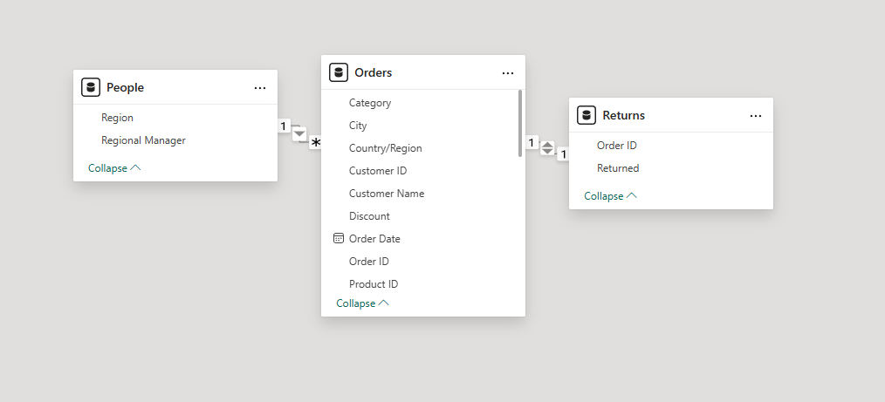

# 📊 Superstore Sales & Profitability Intelligence Dashboard (2019-2022)

## 📌 Project Overview
This project is an end-to-end Business Intelligence solution developed using **Power BI** and **DAX**. It goes beyond basic reporting to provide a deep-dive analysis of a $1.1M retail business, focusing on uncovering "profit leaks" and telling the data-driven story of the store's growth and hidden challenges.

---

## 📖 Data Storytelling: The "Growth" vs "Profit" Narrative

### Chapter 1: The Illusion of Success
Between 2019 and 2022, the Superstore grew consistently, with sales climbing from $226K to $357K (a 58% increase) and order volume rising to 1,723 orders annually. However, total profit only reached $106.9K, revealing an underlying efficiency problem .

### Chapter 2: The Profit Leakage (Discount Analysis)
The analysis uncovered a critical "Discount Trap." Every time discounts increase, profit decreases (Correlation: -0.27) .
* **High-Discount Crisis:** 640 orders with discounts ≥40% resulted in a collective loss of **$59,403**.
* **Impact:** This single policy wiped out **55% of the total potential profit** .
* **Profitable Zone:** Zero-discount orders were found to be the most profitable, maintaining the healthiest margins .

### Chapter 3: Category Dynamics (The Furniture Crisis)
* **Furniture (The Revenue Driver):** Accounts for 57% of total sales ($638K) but has a critical margin crisis of only **2.8%** .
* **Technology (The Future):** Delivers the highest margin at **19.7%**, proving to be the most efficient category despite lower sales volume compared to Furniture .
* **Bleeding Sub-Categories:** Tables and Bookcases specifically destroyed category value with a combined loss of **$16,143** .

---

## 🛠️ Technical Implementation

### Data Modeling & ETL
* **Power Query:** Performed comprehensive cleaning, including data type transformations and column profiling to ensure 100% data validity.
* **Star Schema:** Built a robust model connecting the `Orders` fact table to `People` and `Returns` dimension tables via One-to-Many relationships.

### Advanced DAX Analytics
The project leverages complex DAX to drive business logic:
* **Profit Leakage Identification:** Calculated `Discount Loss` and `High Discount Orders >40%` to quantify policy impact.
* **Profitability Benchmarking:** Developed `Profit Margin` and `Average Order Value` measures.
* **Performance Ranking:** Used `RANKX` to dynamically isolate the `Top & Bottom 5` profitable products.
* **Time Intelligence:** Engineered `YoY Growth` to compare performance across the 4-year period.

---

## 💡 Strategic Recommendations
1. **Discount Capping:** Immediately cap discounts at **20%** to prevent the $59K profit erosion .
2. **Repricing Strategy:** Urgently audit and reprice **Tables and Bookcases** or consider discontinuing them as they have been loss-making for 4 years.
3. **Operational Shift:** Scale the **Technology** category by at least 20% to add approximately $7,100 in pure profit with no operational changes.
4. **Regional Focus:** Replicate the success of the **West Region** ($41K profit, 11.6% margin) across other territories .

---

### 📝 How to View
1. Open the `super store sales.pdf` to see the final dashboard design.
2. Review the `README.md` (this file) for the full business context and technical documentation.
